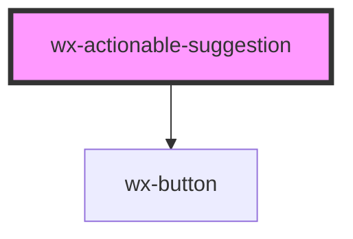

# wx-actionable-suggestion

<!-- Auto Generated Below -->

## Properties

| Property     | Attribute    | Description | Type     | Default     |
| ------------ | ------------ | ----------- | -------- | ----------- |
| `action`     | `action`     |             | `string` | `undefined` |
| `suggestion` | `suggestion` |             | `string` | `undefined` |

## Events

| Event         | Description | Type               |
| ------------- | ----------- | ------------------ |
| `clickAction` |             | `CustomEvent<any>` |

## Dependencies

### Depends on

- [wx-button](../wx-button)

### Graph

----------------------------------------------

*Built with [StencilJS](https://stenciljs.com/)*
