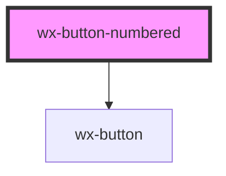

# wx-button-numbered

<!-- Auto Generated Below -->

## Properties

| Property | Attribute | Description | Type     | Default     |
| -------- | --------- | ----------- | -------- | ----------- |
| `number` | `number`  |             | `number` | `undefined` |

## Dependencies

### Depends on

- [wx-button](../wx-button)

### Graph

----------------------------------------------

*Built with [StencilJS](https://stenciljs.com/)*
