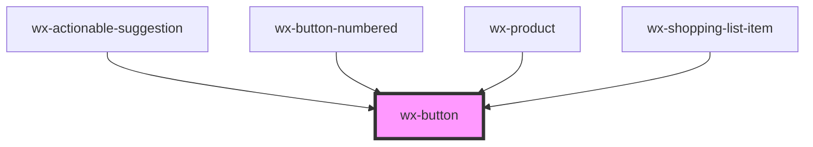

# wx-button

<!-- Auto Generated Below -->

## Properties

| Property   | Attribute  | Description | Type                       | Default     |
| ---------- | ---------- | ----------- | -------------------------- | ----------- |
| `disabled` | `disabled` |             | `boolean`                  | `undefined` |
| `look`     | `look`     |             | `"primary" \| "secondary"` | `'primary'` |

## Dependencies

### Used by

 - [wx-actionable-suggestion](../wx-actionable-suggestion)
 - [wx-button-numbered](../wx-button-numbered)
 - [wx-product](../wx-product)
 - [wx-shopping-list-item](../wx-shopping-list-item)

### Graph

----------------------------------------------

*Built with [StencilJS](https://stenciljs.com/)*
