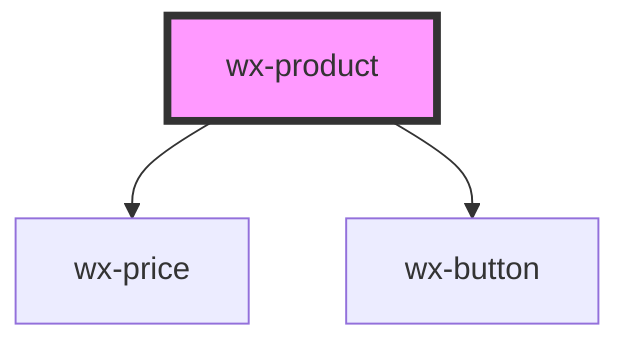

# wx-product

<!-- Auto Generated Below -->

## Properties

| Property      | Attribute     | Description | Type      | Default     |
| ------------- | ------------- | ----------- | --------- | ----------- |
| `imageUrl`    | `imageurl`    |             | `string`  | `undefined` |
| `name`        | `name`        |             | `string`  | `undefined` |
| `price`       | `price`       |             | `number`  | `undefined` |
| `priceNotes`  | `pricenotes`  |             | `string`  | `undefined` |
| `productId`   | `productid`   |             | `string`  | `undefined` |
| `savedToList` | `savedtolist` |             | `boolean` | `undefined` |

## Events

| Event             | Description | Type                  |
| ----------------- | ----------- | --------------------- |
| `clickAddToCart`  |             | `CustomEvent<string>` |
| `clickSaveToList` |             | `CustomEvent<string>` |

## Dependencies

### Depends on

- [wx-price](../wx-price)
- [wx-button](../wx-button)

### Graph

----------------------------------------------

*Built with [StencilJS](https://stenciljs.com/)*
