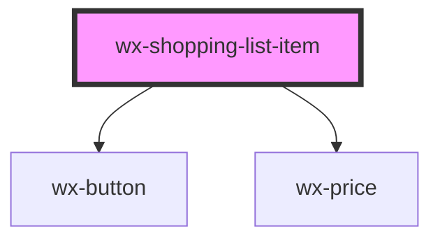

# wx-shopping-list-item

<!-- Auto Generated Below -->

## Properties

| Property    | Attribute   | Description | Type      | Default     |
| ----------- | ----------- | ----------- | --------- | ----------- |
| `deleted`   | `deleted`   |             | `boolean` | `undefined` |
| `imageUrl`  | `imageurl`  |             | `string`  | `undefined` |
| `name`      | `name`      |             | `string`  | `undefined` |
| `price`     | `price`     |             | `number`  | `undefined` |
| `productId` | `productid` |             | `string`  | `undefined` |

## Events

| Event             | Description | Type               |
| ----------------- | ----------- | ------------------ |
| `clickAddToCart`  |             | `CustomEvent<any>` |
| `clickDelete`     |             | `CustomEvent<any>` |
| `clickUndoDelete` |             | `CustomEvent<any>` |

## Dependencies

### Depends on

- [wx-button](../wx-button)
- [wx-price](../wx-price)

### Graph

----------------------------------------------

*Built with [StencilJS](https://stenciljs.com/)*
